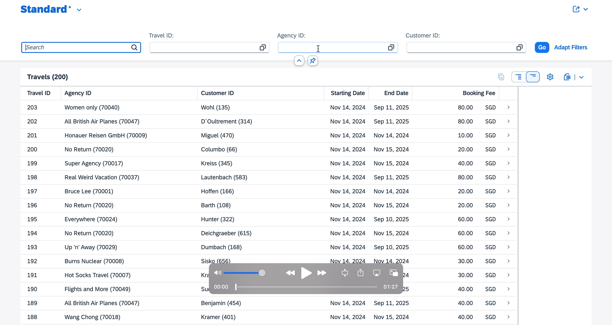

# Building a Travel App Using ABAP RESTful Programming Model and Fiori

## Project Background

This project was done as a result of following the [SAP course](https://learning.sap.com/courses/building-apps-with-the-abap-restful-application-programming-model/the-big-picture_LE_0e44d65f-a777-4e38-a743-e333c60191a2) on Building apps using ABAP RESTful Programming Model.

The aim of this project was to build an App that tracks booking and travels. I'll be taking you through step by step process on how I built this application.

**Project Deliverable:**
- An interactive Fiori Application: Please click the image below to play the demo.

## Project Implementation

See this project as a result of the backend implementation using ABAP and the frontend implementation using SAP Fiori.

Here's a step by step guide on how I accomplished this:

### 1. Design an Entity Relationship Diagram

This application involves five tables (travel, booking, customer, flight, and agency) that had relationship with each other.

The relationships which was established using ABAP enables the navigation of data on the Fiori App.

It is important to note that the primary data sources in this project were the Travel and Booking data while the other three tables were the secondary data sources which were referenced in the primary data sources when establishing the table relationships.

Here's a snapshot of the entity relationship diagram that illustrates the relationship between the tables.

### 2. Create the Database Tables

The next step was to create the Travel and Booking data while referencing the secondary data sources.

Here's a screenshot of the ABAP code that defines the Travel database table.

Notice how the agency and customer secondary data sources were referenced on the agency_id and customer_id while establishing their relationships.

### 3. Update the Database Tables with Data

After the Travel and Booking database tables were created, demo data was written into them.

Here's a preview of the tables

**Travel Database Table Preview**

**Booking Database Table Preview**

### 4. Create Core Data Services Data Model

Now that we have the database tables, it is important to create the Core Data Services (CDS) data model for these database tables. 

CDS views act as an abstraction layer on the database tables where complexities such as aggregations, calculations and joins are done in the database layer before the results are transferred to the application layer via the CDS projection. This is important to enable consumption by the Fiori application.

Here's a screenshot of the ABAP program that defines the CDS view on the Travel database table. 

Notice how the associations were defined from line 8 to enable joins with other tables.

### 5. Define the Core Data Services Data Model Projection

After the CDS views were created for the database tables, it's important to define projections to ensure that it's projected on the Fiori application as desired. 

Here's a screenshot of the ABAP program that defines the CDS projection on the created CDS data model for the Travel data.

Notice how the associations defined in the CDS data model were still listed here. There were also some annotations. Below is a brief explanation of the annotations in this program:

- `@Search.defaultSearchElement`: This marks the field below it (eg. TravelID, AgencyID, and CustomerID) as the default search element in the CDS view. This will reflect as a search box for each of these fields.

- `@Consumption.valueHelpDefinition`: This defines a value help for the field below it (eg. AgencyID, CustomerID, and CurrencyCode). It links the field to another entity (e.g., /DMO/I_Agency, /DMO/I_Customer, I_Currency) and specifies the corresponding field in that entity. When the user triggers F4 in the application, the system displays values from the linked entity.

- `@ObjectModel.text.element`: This specifies a text field that should be associated with a key field. In this case, the text field that are expected to be associated with a key field are the AgencyName with the AgencyID and the CustomerName with the CustomerID. This reflects in the Fiori application as concatenation between the text field and the ID. Eg. `Wohl (135)`.

- `@Semantics.amount.currencyCode`: This associates an amount with a currencycode field so that it displays the amount field in the right currency format (eg. USD)

### 6. Enrich the Projected Data Model with UI Metadata

UI Metadata annotations are important to control how the data is displayed and interacted with on the Fiori app UI.

Below is a snapshot of the UI Metadata annotations of the travel data

Each of the fields had their position defined on the UI depending on where their values were expected to appear. Also, notice how the LastChangedAt and LocalLastChangedAt fields were defined to be hidden on line 64 and line 67 respectively. Hence, they won't be displayed on the UI.

Want to have a feel of how this came out on the UI? Here's how it looks for a particular TravelID (203).

### 7. Expose the CDS model as OData service Using Service Definition and Service Binding

Finally! We are at the step where we'll make Fiori consume our data model.

First, we'll create service definition that defines the data model projections that should be exposed in the Fiori application.

Here's a screenshot of the service definition program.

Notice how we exposed the projections defined from our primary data sources and the ones from the secondary data sources.

After defining the service, we need to bind it to a protocol (in this case, OData) that will then make our service accessible. This is where we define a service binding.

At the end, we have our fully accessible application via a URL

## Conclusion

This project had an end goal of having a Fiori application that helps a business to keep track of travels and bookings. Fortunately, this end goal was achieved.

You can access the source code in the src folder which was pushed to github using Abapgit. Thank you!